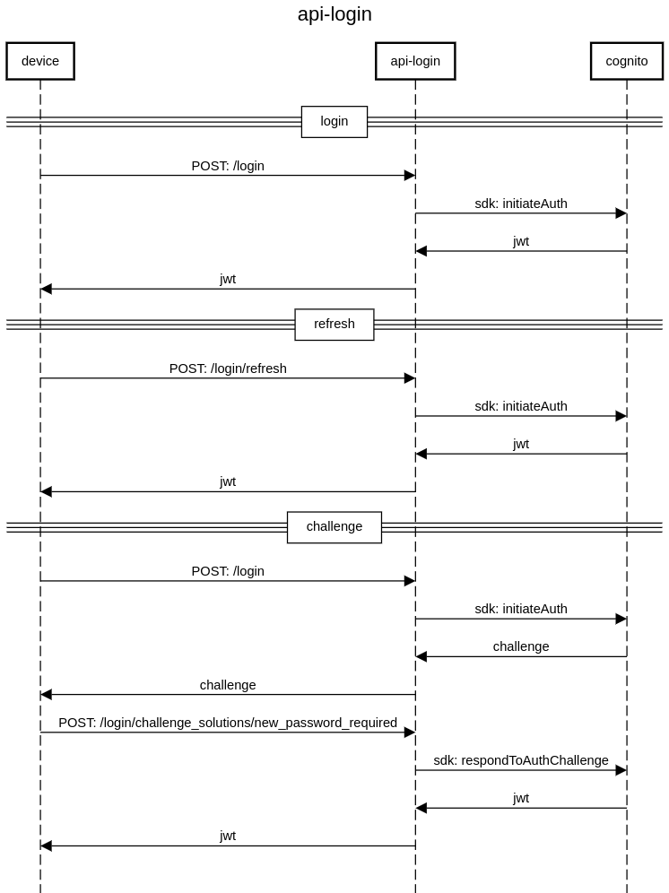

# api-login

[](https://sonar.tools.menta.global/dashboard?id=com.menta%3Aapi-login)
[](https://sonar.tools.menta.global/dashboard?id=com.menta%3Aapi-login)
[](https://sonar.tools.menta.global/dashboard?id=com.menta%3Aapi-login)
[](https://sonar.tools.menta.global/dashboard?id=com.menta%3Aapi-login)
[](https://sonar.tools.menta.global/dashboard?id=com.menta%3Aapi-login)
[](https://sonar.tools.menta.global/dashboard?id=com.menta%3Aapi-login)
[](https://sonar.tools.menta.global/dashboard?id=com.menta%3Aapi-login)
[](https://sonar.tools.menta.global/dashboard?id=com.menta%3Aapi-login)
[](https://sonar.tools.menta.global/dashboard?id=com.menta%3Aapi-login)
[](https://sonar.tools.menta.global/dashboard?id=com.menta%3Aapi-login)
[](https://api-internal.dev.apps.menta.global/login/swagger-ui/index.html)
[](postman)

**Description**: api-login provee tokens para la autenticación y autorización de usuarios


## Index:
- [Stack](#stack)
- [How to Run](#how-to-run)
  - [Config](#config)
  - [Build](#build)
  - [Run](#run)
  - [Unit Tests](#unit-tests)
- [Contributing](#contributing)
- [Usage](#usage)

### Stack 🛠️
- java 11
- kotlin 1.6
- spring-boot 2.6
- [arrow-kt](https://arrow-kt.io/)
- [kotest](https://kotest.io/)
- [cognito](https://docs.aws.amazon.com/sdk-for-java/latest/developer-guide/examples-cognito.html)

### How to Run

#### Config

##### springdoc

Esto se usa para definir el path en el que se expondra el swagger del servicio

```yaml
springdoc:
  api-docs:
    path: ${APP_PATH}/swagger-ui/api-docs
  swagger-ui:
    path: ${APP_PATH}/index.html
```

En _Run/Debug Configurations_ -> _Build and run_ -> _VM Options_ agregar `-DAPP_PATH=/api-login`

##### cognito

Para utilizar cognito se requiere:
- **credenciales**: secret y accessKey
- **user-pool** de cada tipo de usuario

En el caso de levantar cognito en un ambiente, no hacen falta las credenciales.

```yaml
cognito:
  provider:
    credentials:
      secret: "${COGNITO_AWS_SECRET}"
      accessKey: "${COGNITO_AWS_ACCESS_KEY}"
    region: "${AWS_REGION}"
    user-pools:
      MERCHANT:
        code: "${COGNITO_AWS_MERCHANT_POOL}"
        client-id: "${COGNITO_AWS_MERCHANT_CLIENT_ID}"
      CUSTOMER:
        code: "${COGNITO_AWS_CUSTOMER_POOL}"
        client-id: "${COGNITO_AWS_CUSTOMER_CLIENT_ID}"
      SUPPORT:
        code: "${COGNITO_AWS_SUPPORT_POOL}"
        client-id: "${COGNITO_AWS_CUSTOMER_CLIENT_ID}"
````
En _Run/Debug Configurations_ -> _Build and run_ -> _VM Options_ agregar `...`


#### Build

Ejecuta éste comando para instalar las dependencias y buildear el proyecto:

```bash
$ ./gradlew build
```

#### Run

Para correr el proyecto:

```bash
$ ./gradlew bootRun
```

El entorno de desarrollo corre sobre <http://localhost:8080>. Ejecuta una llamada GET de prueba en <http://localhost:8080/actuator>

#### Unit Tests

Para correr los tests unitarios
```bash
$ ./gradlew test
```

### Contributing
Leer [Material Técnico](https://mentaglobal.atlassian.net/wiki/spaces/PROD/pages/3965199/Material+T+cnico), sobre todo la seccion sobre [Arquitectura Hexagonal](https://mentaglobal.atlassian.net/wiki/spaces/PROD/pages/4423684/Arquitectura+Hexagonal)


### Usage
