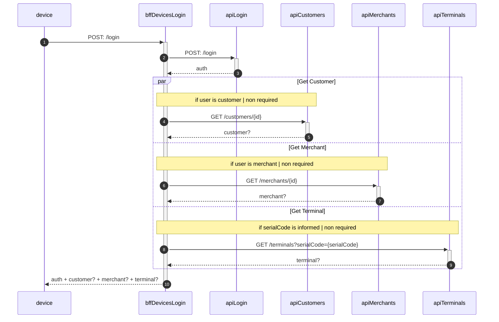

# bff-devices-login

[](https://sonar.tools.menta.global/dashboard?id=com.menta%3Abff-devices-login)
[](https://sonar.tools.menta.global/dashboard?id=com.menta%3Abff-devices-login)
[](https://sonar.tools.menta.global/dashboard?id=com.menta%3Abff-devices-login)
[](https://sonar.tools.menta.global/dashboard?id=com.menta%3Abff-devices-login)
[](https://sonar.tools.menta.global/dashboard?id=com.menta%3Abff-devices-login)
[](https://sonar.tools.menta.global/dashboard?id=com.menta%3Abff-devices-login)
[](https://sonar.tools.menta.global/dashboard?id=com.menta%3Abff-devices-login)
[](https://sonar.tools.menta.global/dashboard?id=com.menta%3Abff-devices-login)
[](https://sonar.tools.menta.global/dashboard?id=com.menta%3Abff-devices-login)
[](https://sonar.tools.menta.global/dashboard?id=com.menta%3Abff-devices-login)
[](https://api.dev.apps.menta.global/bff-devices-login/swagger-ui/index.html)
[](postman)

## Description: 
bff-devices-login provee tokens para la autenticación y autorización de usuarios, además de información adicional como
terminals, customers y merchants según corresponda.

## Index:
- [Stack](#stack)
- [Dependencies](#dependencies)
- [How to Run](#how-to-run)
  - [Config](#config)
  - [Build](#build)
  - [Run](#run)
  - [Unit Tests](#unit-tests)
- [Contributing](#contributing)
- [Usage](#usage)

### Stack 🛠️
- java 11
- kotlin 1.6
- spring-boot 2.6
- [arrow-kt](https://arrow-kt.io/)
- [kotest](https://kotest.io/)

## Dependencies
- [api-login](https://git.menta.global/backend/auth/api-login)
- [api-users](https://git.menta.global/backend/entities/api-users)
- [api-customers](https://git.menta.global/backend/entities/api-customers)
- [api-merchants](https://git.menta.global/backend/entities/api-merchants)
- [api-terminals](https://git.menta.global/backend/entities/api-terminals)

### How to Run

#### Config

##### springdoc

Esto se usa para definir el path en el que se expondra el swagger del servicio

```yaml
springdoc:
  api-docs:
    path: ${APP_PATH}/swagger-ui/api-docs
  swagger-ui:
    path: ${APP_PATH}/index.html
```

En _Run/Debug Configurations_ -> _Build and run_ -> _VM Options_ agregar `-DAPP_PATH=/bff-devices-login`

#### Build

Ejecuta éste comando para instalar las dependencias y buildear el proyecto:

```bash
$ ./gradlew build
```

#### Run

Para correr el proyecto:

```bash
$ ./gradlew bootRun
```

El entorno de desarrollo corre sobre <http://localhost:8080>. Ejecuta una llamada GET de prueba en <http://localhost:8080/actuator>

#### Unit Tests

Para correr los tests unitarios
```bash
$ ./gradlew test
```

### Contributing
Leer [Material Técnico](https://mentaglobal.atlassian.net/wiki/spaces/PROD/pages/3965199/Material+T+cnico), sobre todo la seccion sobre [Arquitectura Hexagonal](https://mentaglobal.atlassian.net/wiki/spaces/PROD/pages/4423684/Arquitectura+Hexagonal)

### Usage
El comportamiento se mantiene tanto para __login__ como para __refresh__ y __challenge__


